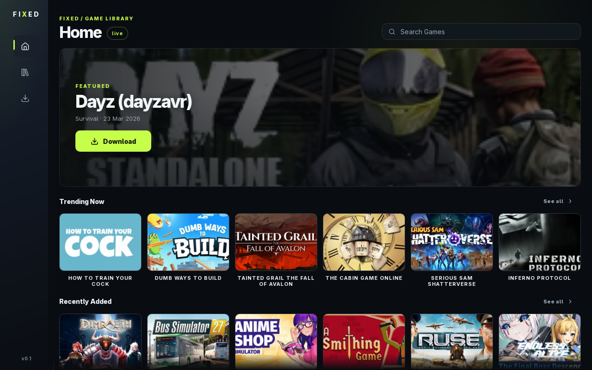
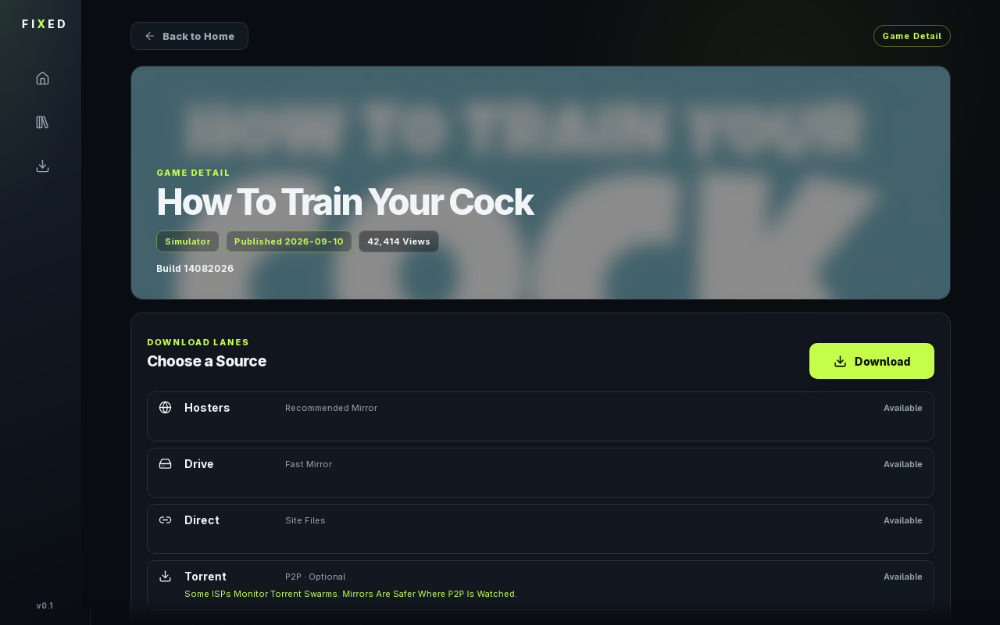
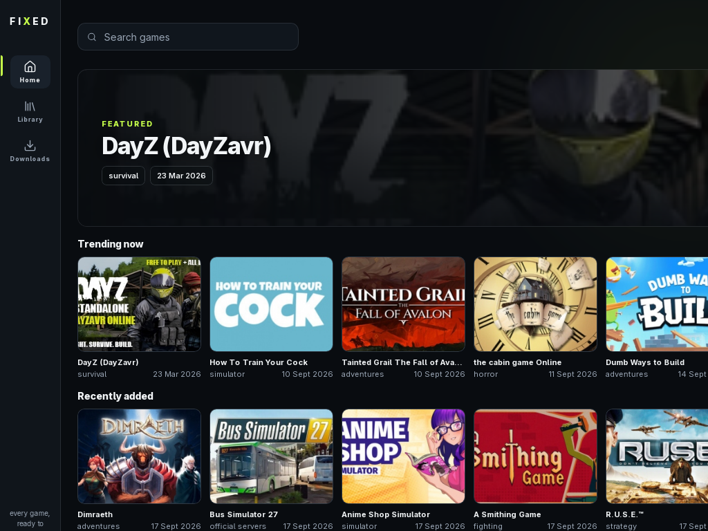

# FIXED

Desktop client for [online-fix.me](https://online-fix.me): browse, download, extract, add to Steam and play. One click, zero setup, minimal questions.

[](https://github.com/edersonff/fixed/actions/workflows/ci.yml)
[](https://github.com/edersonff/fixed/releases)



## What it does

One pipeline, end to end. You click Download once, FIXED does the rest:

1. **Download** — HTTP mirror lane first (Pixeldrain-backed, resumable range requests), torrent as automatic fallback. Live progress with lane badge.
2. **Extract** — password handled automatically, installers cleaned up after install.
3. **Steam** — non-Steam shortcut written into your library with Proton launch options, idempotent.
4. **Play** — one click launches the game through Steam.
5. **Plugins** — drop a BepInEx zip; Fix Repair is reapplied on top automatically.



## Features

- Live catalog from the site with instant client-side search: fuzzy matching (finds `BOMBANANA` from `bombanana`) and automatic pagination while you search.
- Video review card per game, straight from the game page.
- Download choice without nagging: HTTP mirror when available, torrent fallback, ISP warning on the torrent lane.
- Downloads queue with progress, lane badge, Stop all while active, Play and Add plugin when ready.
- Tauri v2 + Rust core: scraper, torrent engine and HTTP downloader run natively.



## Install

Grab a bundle from [releases](https://github.com/edersonff/fixed/releases):

- Linux: `.deb` or `.AppImage`
- Windows: `.msi` or `-setup.exe`

## Develop

```bash
# frontend + backend in one terminal
cd app
WEBKIT_DISABLE_DMABUF_RENDERER=1 pnpm tauri dev
```

The `WEBKIT_DISABLE_DMABUF_RENDERER=1` env is required on NVIDIA + WebKitGTK.

Rust core lives in `core/` (scraper, torrent, HTTP download, extraction, Steam shortcuts, plugin install). CI builds and checks both Linux and Windows on every push.

## Notes

Community client, not affiliated with online-fix.me. For personal use with games you own.
